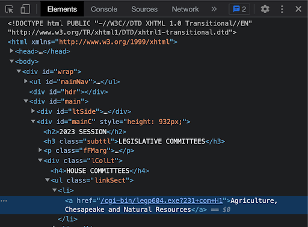
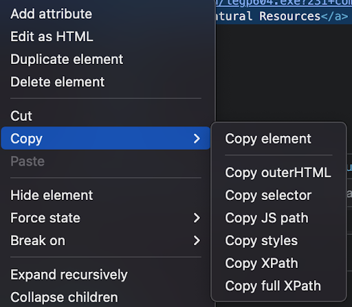

# Writing a Committee Scraper

## For Those Completely New to Writing Scrapers
- [What do we mean when we use the term “web scraping”? What is a scraper?](https://data-lessons.github.io/library-webscraping-DEPRECATED/01-introduction/)
- [How do you write a web scraper?](https://www.edureka.co/blog/web-scraping-with-python/)
  * An overview from the source above:
  * When you run the code for web scraping, a request is sent to the URL that you have mentioned. As a response to the request, the server sends the data and allows you to read the HTML or XML page. The code then parses the HTML or XML page, finds the data and extracts it. 
  * To extract data using web scraping with python, you need to follow these basic steps:
    * Find the URL that you want to scrape
    * Find the data you want to extract
    * Write the code
    * Run the code and extract the data
    * Store the data in the required format 


## For those new to Plural Open / Open States:
- [What is Plural Open?](https://docs.openstates.org/#about-plural-open)
- [What is an open source project?](https://opensource.com/resources/what-open-source)
- [How do you contribute to Plural Open?](https://docs.openstates.org/contributing/#getting-started)
- What projects are we looking for contributions on?
    * [Committee Scrapers](https://github.com/openstates/issues/issues?q=is%3Aissue+is%3Aopen+label%3A%22good+first+scraper%22)
    * [Other issues](https://github.com/openstates/issues/issues)


## Writing Committee Scrapers
### Background: What are legislative committees?
This information *isn’t necessary for writing scrapers*, but if you’re interested in more context or want to know why committee data is important, this is where you’ll find it! 

Legislative committees are groups of legislators selected by House and Senate leadership to consider legislation concerning a certain subject or set of subjects (ex: Appropriations, Environment & Natural Resources, Criminal Justice & Public Safety). While most state legislatures have separate House and Senate committees, a few states (CT, ME, MA, and NE) have just one set of committees. Most legislators serve on between 2 and 5 committees each session. 

Standing committees are permanent committees that are created at the beginning of the legislative session in the House, Senate, or Joint Rules. Other committee types (select committees, interim committees, study committees) are time-limited and often created by legislation or resolutions.

Because the vast majority of legislation goes through the committee process, and because the committee membership has such an outsized role on whether that legislation lives or dies, it's incredibly important that people have accurate and up to date information about committees, their membership, and their work. 

### Writing a Committee Scraper, Step by Step
- How do I set up my environment?
  - Make sure you've walked through our [installation prerequisities](https://docs.openstates.org/contributing/#installing-prerequisites)
- Where should my code live?
  - All committee scrapers live in the `scrapers_next` directory of the [openstates_scrapers](https://github.com/openstates/openstates-scrapers) repository
  - When you're ready to commit your code, this is where your new committee scraper will live too!
- What are the steps for working on my committee scraper locally?
 1. Fork the openstates-scrapers repository ([what is a fork](https://docs.github.com/en/get-started/quickstart/fork-a-repo#forking-a-repository)?)
 2. Find the state you want to write a committee scraper for under the `scrapers_next` directory
 3. Create a `committees.py` file inside of that state's directory
 4. Write your committee scraper code! 
- What information does a committee scraper need to grab?
  * Name of the committee
  * Chamber (upper/lower/etc)
  * Classification (committee, subcommittee)
  * Parent (if it is a subcommittee)
  * Sources (home page for the list of committees, specific page for that committee, etc)
  * Members (name and role on the committee)
  * Example of complete data: 
    ```json
    {
    "name": "Revenue", 
    "chamber": "upper",
    "classification": "committee", 
    "parent": null, 
    "sources": [
        {"url": "https://www.ilga.gov/senate/committees/default.asp", "note": "homepage"}, 
        {"url": "https://www.ilga.gov/senate/committees/members.asp?CommitteeID=2688", "note": ""}], 
    "links": [], 
    "other_names": [], 
    "members": [
        {"name": "Mattie Hunter", "role": "Chair", "person_id": null}, 
        {"name": "Steve Stadelman", "role": "Vice-Chair", "person_id": null}, 
        {"name": "Robert F. Martwick", "role": "Member", "person_id": null}, 
        {"name": "Cristina H. Pacione-Zayas", "role": "Member", "person_id": null}, 
        {"name": "Robert Peters", "role": "Member", "person_id": null}, 
        {"name": "Elgie R. Sims, Jr.", "role": "Member", "person_id": null}, 
        {"name": "Donald P. DeWitte", "role": "Minority", "person_id": null}, 
        {"name": "Dale Fowler", "role": "Member", "person_id": null}, 
        {"name": "Jil Tracy", "role": "Member", "person_id": null}, 
        {"name": "Sally J. Turner", "role": "Member", "person_id": null}], 
    "extras": {}
    }
    ```
- What does a complete committee scraper look like?
  * [An example](https://github.com/openstates/openstates-scrapers/blob/main/scrapers_next/mo/committees.py) committee scraper
  * The way committee scrapers look will vary depending on how the website for the state is set up. Most of them will have a list of committees for the House, a list of committees for the Senate, and individual pages for each committee that includes details about membership and/or subcommittees
- I know what information I want to grab, but how do I grab it?
  * Grab the information you need using selectors (<- a guide to selectors)
  * Getting the selector/XPath on chrome:
    * Right click the item you want to grab
    * Click “inspect”
    * 
    * A panel will pop up and the element that you’re inspecting should be highlighted. Click on the three dots on the left side of the highlight
    * 
    * Hover over “copy” and click on either selector (for a CSS selector) or XPath to copy it
    * 
  * There aren’t any rules about whether XPath or CSS selectors are better. Use whichever helps you grab the information you need!

### General Scraper Writing Tips 
- What are helpful tools for writing scrapers?
  * The most helpful tool that you can use to write a committee scraper is the python package [spatula](https://jamesturk.github.io/spatula/) 
  * [A walkthrough](https://jamesturk.github.io/spatula/scraper-basics/) on how to write a scraper using spatula 
* How do I run a scraper?
  * Follow the instructions [here](https://docs.openstates.org/contributing/scrapers/#running-spatula-scrapers). If you haven’t read the [Getting Started](https://docs.openstates.org/contributing/#getting-started), make sure you do that first!
  * The command for running a spatula scraper is `poetry run spatula scrape {directory your python file is in}.{state your scraper is for}.committees.{function (optional)}`
    * Example: To run the entire committee scraper for Missouri, the command would be `poetry run spatula scrape scrapers_next.mo.committees`
* Help! My code doesn't work! 
  * Stuck? Think it through and ask us for help!
    * What’s not working? What do you think should happen? What’s actually happening?
  * Exception handling can be great for weird cases, like a specific committee’s information being unavailable 
    * Spatula lets you easily skip over weird cases
  * Debug and quickly test if your CSS or Xpath selector is accurate with spatula test for a single page
    * Before running spatula scrape, you can test the logic of what you’ve already written (and essentially get a quick “preview”) in the terminal. This is especially helpful for making sure you’re using the correct CSS or Xpath selector for an element.
    * You can set an [example_source](https://jamesturk.github.io/spatula/data-models/#example_source) as a default URL to keep running spatula scrape on
    * Example use case: After scraping a list of committees on one page, I now need specific information about each committee. Each committee has its own webpage (that we navigate to from that list of committees), and the format for each webpage is fairly similar (this is most likely the case!). I can set the `example_source` as a single committee’s more-detailed webpage, and as I write that part of the scraper, I can keep running spatula test to see in my terminal that I’m grabbing the correct information from that specific webpage.
    * This should save time and prevent some headaches!
  


    


